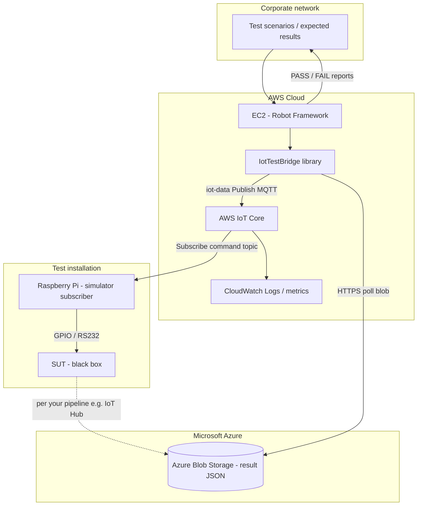
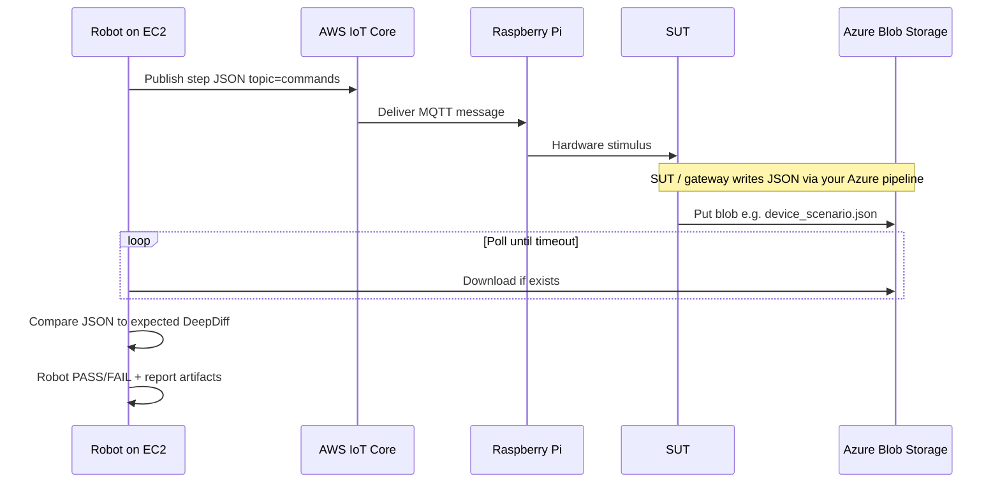

# IoT-SIM

End-to-end test orchestration: **Robot Framework on AWS EC2** publishes simulator commands through **AWS IoT Core**; **Raspberry Pi** subscribers drive bench hardware (GPIO/RS232) against a **system under test (SUT)** you treat as a black box. Result JSON is stored in **Azure Blob Storage** (another system)—Robot **polls** the blob, **compares** actual JSON to expected values, and **records** pass/fail through normal Robot outputs (`report.html`, `log.html`, `output.xml`).

**Repository:** [https://github.com/shafkat1/IoT-SIM](https://github.com/shafkat1/IoT-SIM)

This repo does **not** implement SUT internals. It focuses on the **contract** between automation (Robot), AWS messaging (IoT Core), edge simulators (Pi), and cross-cloud result artifacts (Azure Blob). **Amazon S3** remains available as an optional result store if you ever want an all-AWS path.

---

## Architecture (AWS commands, Azure results)



### Sequence (one step)



---

## Components

| Layer | Responsibility |
|--------|----------------|
| **Robot Framework (EC2)** | Runs scenarios; publishes steps to **AWS IoT Core**; polls **Azure Blob** for result JSON; asserts actual vs expected (DeepDiff). |
| **`IotTestBridge.py`** | Keywords: AWS IoT publish (`iot-data`), **Azure Blob** wait/read (and optional **S3**), JSON compare; optional generic MQTT. |
| **AWS IoT Core** | MQTT for commands; EC2 uses IAM `iot:Publish`; Pis use X.509 policies (`Connect`, `Subscribe`, `Receive`). |
| **Azure Blob Storage** | Canonical store for result files (e.g. `{device_id}_{scenario_id}.json`) populated by **your** Azure-side system (e.g. IoT Hub routing, Function, etc.). |
| **`simulator_subscriber.py` (Pi)** | Subscribes to command topics; you map `values` to GPIO/serial. Supports **plain MQTT** or **IoT Core mutual TLS** (port 8883). |

---

## MQTT message envelope (commands)

Published JSON (Robot → AWS IoT → Pi):

| Field | Meaning |
|--------|---------|
| `run_id` | UUID for correlation (optional in downstream blob naming if you extend the pipeline). |
| `device_id` | Logical device under test. |
| `scenario_id` | Test scenario identifier. |
| `step_id` | Single step within the scenario. |
| `values` | Arbitrary JSON object interpreted by your simulator (sensor setpoints, digital IO, etc.). |

---

## Environment variables

| Variable | Used by | Purpose |
|----------|---------|---------|
| `AWS_IOT_DATA_ENDPOINT` | Robot / `Publish Iot Step Aws` | IoT **Data** ATS hostname (e.g. `xxxxx-ats.iot.us-east-1.amazonaws.com`). |
| `AWS_REGION` / `AWS_DEFAULT_REGION` | boto3 | Region (optional if set on EC2 instance profile or `~/.aws/config`). |
| `AZURE_STORAGE_CONNECTION_STRING` | Example suite / Blob client | Storage account connection string (or use `AZURE_STORAGE_ACCOUNT_URL` + `DefaultAzureCredential` in your suite). |
| `AZURE_RESULT_CONTAINER` | Example suite | Blob container name (default `results` in the example). |
| `MQTT_*` / `AWS_IOT_*` | Pi subscriber | See `tools/simulator_subscriber.py` and `--help`. |

---

## Credentials (hybrid)

**On EC2**

- **AWS:** Instance profile with `iot:Publish` on command topics.
- **Azure:** Prefer **workload identity federation** or a **managed identity** pattern your org uses for cross-cloud access; alternatively a **service principal** via `DefaultAzureCredential` env vars, or (dev only) `AZURE_STORAGE_CONNECTION_STRING`. The example suite uses a connection string for simplicity—harden for production.

---

## Polling behaviour

`Wait For Result Blob` (and `Wait For Result S3`) poll until the object exists or `timeout_seconds` elapses. Default `poll_seconds=120` (two minutes); set `poll_seconds=300` for a five-minute cadence.

Robot **test results** are the framework’s normal **PASS/FAIL** per keyword/test plus **`report.html`**, **`log.html`**, **`output.xml`**. Add a custom listener or post-step if you need to push summaries elsewhere (Jira, S3, etc.).

---

## Setup

```bash
python -m venv .venv
.venv\Scripts\activate   # Windows
pip install -r requirements.txt
```

Run the example suite (AWS IoT + Azure Blob):

```bash
set PYTHONPATH=robot\libraries
set AWS_IOT_DATA_ENDPOINT=your-account-ats.iot.region.amazonaws.com
set AWS_REGION=us-east-1
set AZURE_STORAGE_CONNECTION_STRING=DefaultEndpointsProtocol=https;...
set AZURE_RESULT_CONTAINER=results
robot robot\suites\example_iot_flow.robot
```

**Raspberry Pi (AWS IoT Core TLS)**

```bash
pip install paho-mqtt
python tools/simulator_subscriber.py \
  --iot-endpoint xxxxx-ats.iot.us-east-1.amazonaws.com \
  --root-ca AmazonRootCA1.pem \
  --cert device.pem.crt \
  --key private.pem.key \
  --topic "lynx/simulator/#"
```

---

## Repository layout

```
robot/
  libraries/IotTestBridge.py   # Robot keywords
  suites/example_iot_flow.robot
tools/
  simulator_subscriber.py      # Pi-side MQTT subscriber
requirements.txt
```
