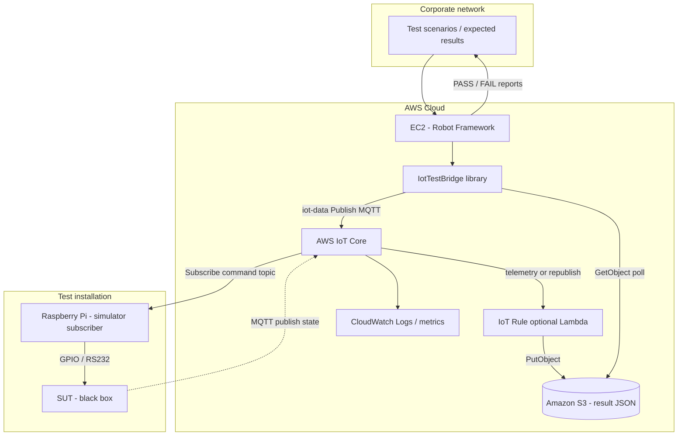
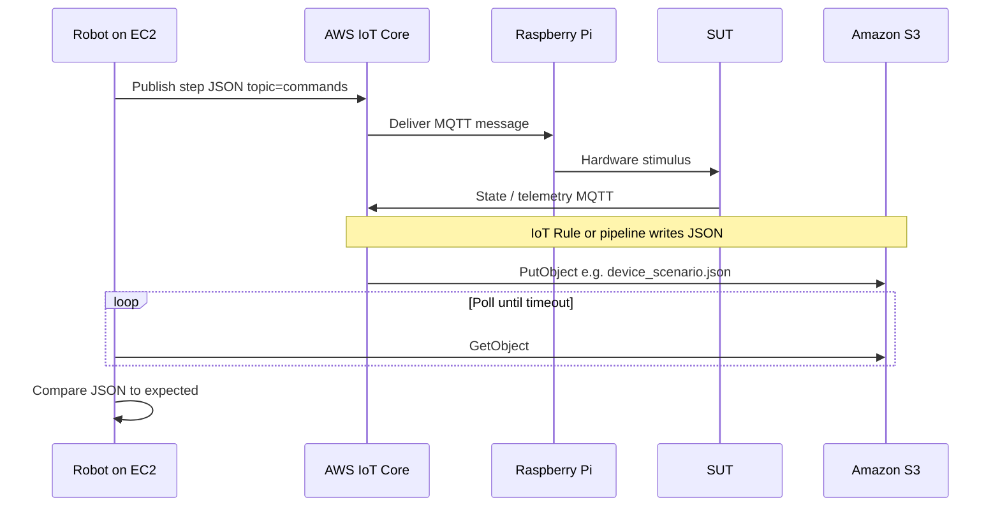

# IoT-SIM

End-to-end test orchestration: **Robot Framework on AWS EC2** publishes simulator commands through **AWS IoT Core**, **Raspberry Pi** subscribers drive bench hardware (GPIO/RS232) against a **system under test (SUT)** you treat as a black box, and Robot validates **JSON results** stored in **Amazon S3**.

**Repository:** [https://github.com/shafkat1/IoT-SIM](https://github.com/shafkat1/IoT-SIM)

This repo does **not** implement SUT internals. It focuses on the **contract** between automation (Robot), cloud messaging (IoT Core), edge simulators (Pi), and result artifacts (S3).

---

## Architecture



### Sequence (one step)



---

## Components

| Layer | Responsibility |
|--------|----------------|
| **Robot Framework (EC2)** | Runs scenarios; publishes steps; polls S3; asserts actual vs expected JSON (DeepDiff). |
| **`IotTestBridge.py`** | Keywords: AWS IoT publish (`iot-data`), S3 wait/read, JSON compare; optional generic MQTT for a private broker. |
| **AWS IoT Core** | MQTT broker + device registry; EC2 uses IAM `iot:Publish`; Pis use X.509 policies (`Connect`, `Subscribe`, `Receive`). |
| **Amazon S3** | Canonical store for result files (e.g. `{device_id}_{scenario_id}.json`). Populate via **IoT Rule** → S3 action (or Lambda). |
| **`simulator_subscriber.py` (Pi)** | Subscribes to command topics; you map `values` to GPIO/serial. Supports **plain MQTT** or **IoT Core mutual TLS** (port 8883). |

---

## MQTT message envelope (commands)

Published JSON (Robot → IoT → Pi):

| Field | Meaning |
|--------|---------|
| `run_id` | UUID for correlation (optional in downstream S3 key if you extend the pipeline). |
| `device_id` | Logical device under test. |
| `scenario_id` | Test scenario identifier. |
| `step_id` | Single step within the scenario. |
| `values` | Arbitrary JSON object interpreted by your simulator (sensor setpoints, digital IO, etc.). |

---

## Environment variables

| Variable | Used by | Purpose |
|----------|---------|---------|
| `AWS_IOT_DATA_ENDPOINT` | Robot / `Publish Iot Step Aws` | IoT **Data** ATS hostname (e.g. `xxxxx-ats.iot.us-east-1.amazonaws.com`). |
| `AWS_REGION` / `AWS_DEFAULT_REGION` | boto3 | Region (optional if set on EC2 instance profile or `~/.aws/config`). |
| `S3_RESULTS_BUCKET` | Example suite | Bucket containing result JSON objects. |
| `MQTT_*` / `AWS_IOT_*` | Pi subscriber | See `tools/simulator_subscriber.py` `--help` and script docstring. |

---

## IAM (sketch)

**EC2 instance role for Robot**

- `iot:Publish` on your command topic ARN (prefer prefix-scoped resources).
- `s3:GetObject` on result prefix; optionally `s3:ListBucket` with `s3:prefix` condition if you list keys.

**IoT policy attached to Pi certificate**

- `iot:Connect` (client ID / thing name as appropriate).
- `iot:Subscribe` + `iot:Receive` on your command topic filter (e.g. `lynx/simulator/#`).
- `iot:Publish` only if the Pi must publish telemetry back through IoT Core.

**IoT Rule → S3**

- Rule SQL selects fields from the SUT/gateway topic; S3 action writes keys aligned with Robot (e.g. `${device_id}_${scenario_id}.json` once your pipeline defines `device_id` / `scenario_id` in the payload or topic).

---

## Setup

```bash
python -m venv .venv
.venv\Scripts\activate   # Windows
pip install -r requirements.txt
```

Run the example suite from the repo root (adjust paths if needed):

```bash
set PYTHONPATH=robot\libraries
set AWS_IOT_DATA_ENDPOINT=your-account-ats.iot.region.amazonaws.com
set AWS_REGION=us-east-1
set S3_RESULTS_BUCKET=your-results-bucket
robot robot\suites\example_iot_flow.robot
```

**Raspberry Pi (AWS IoT Core TLS)**

```bash
pip install paho-mqtt
python tools/simulator_subscriber.py \
  --iot-endpoint xxxxx-ats.iot.us-east-1.amazonaws.com \
  --root-ca AmazonRootCA1.pem \
  --cert device.pem.crt \
  --key private.pem.key \
  --topic "lynx/simulator/#"
```

---

## Repository layout

```
robot/
  libraries/IotTestBridge.py   # Robot keywords
  suites/example_iot_flow.robot
tools/
  simulator_subscriber.py      # Pi-side MQTT subscriber
requirements.txt
```

---

## Polling behaviour

`Wait For Result S3` polls until the object exists or `timeout_seconds` elapses. Default `poll_seconds=120` matches a slow SUT cadence; override for faster feedback in CI.

---

## License

Specify your organization’s default license if this repository will be shared outside your team.
